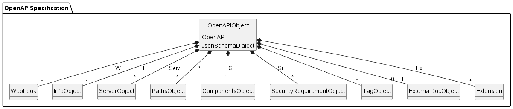

# RAGO - RAG OpenAPI Framework

## Introduction

`RAGO` is the first REST API fuzzing tool modeled in [JastAdd](https://jastadd.cs.lth.se/).


First of all, This tool parses [an OpenAPI specification (OAS)](https://swagger.io/specification/) in Java classes and transfers it into `AST-Node`. These Nodes are able to be re-transformed and saved in JSON which describes its API Specification, if needed.


After the parsing phase, `RAGO` is prepared to generate tests automatically in two different ways based on Fuzzing, [Random Testing](#ragoRandTest) and [Parameter Inference](#ragoParamInf).

## OpenAPI Specification in JastAdd

[OpenAPI specification (OAS)](https://swagger.io/specification/) defines a standard, language-agnostic interface to RESTful APIs which allows both humans and computers and is represented in JSON or YAML. It consists of 30 objects and is structured in a tree-shape.


To understand better how OpenAPI documentations could be transformed in JastAdd, compare the following Object in the JastAdd-grammar and [OpenAPI Object description](https://github.com/OAI/OpenAPI-Specification/blob/main/versions/3.0.3.md#oasObject)
```
OpenAPIObject ::=   <OpenAPI> <JsonSchemaDialect> I:InfoObject Serv:ServerObject*
                    P:PathsObject* W:Webhook* C:ComponentsObject Sr:SecurityRequirementObject*
                    T:TagObject* [E:ExternalDocObject] Ex:Extension*;
```



There are some implementation details developers must consider:

- JastAdd doesn't support `Map`. So, it must be constructed in a tuple (AST-Node). e.g.
    - `ServerVariablesTuple ::= <Name> S:ServerVariableObject;` 
    - `variables` in [Server Object](https://github.com/OAI/OpenAPI-Specification/blob/main/versions/3.0.3.md#serverObject)

- In OAS, several objects can be replaced by [Reference Object](https://github.com/OAI/OpenAPI-Specification/blob/main/versions/3.0.3.md#referenceObject). In `RAGO`, we implemented this structure in an abstract node to every concerned object. e.g. 
    - [Parameter Object](https://github.com/OAI/OpenAPI-Specification/blob/main/versions/3.0.3.md#parameterObject)
    - following abstract node in JastAdd
  
``` 
  abstract ParameterOb;
  ParameterReference : ParameterOb ::= <Ref> ...;
  ParameterObject : ParameterOb ::= <Name> <In> ...;
 ```

- Most objects can be extended with `Extension` containing unfixed name and values. In JastAdd, this is also implemented in a tuple (AST-Node) `Extension ::= <Key> <Value:Object>;`

## Fuzzing in RAGO

To generate API tests automatically, `RAGO` supports two following techniques based on Fuzzing, which involves  providing invalid, unexpected, or random data as inputs to an API.

In this first version, this tool considers only two request types, `GET` and `POST`, and parameters. It means that `RAGO` currently generates only URLs.

### <a name="ragoRandTest"></a>Random Testing

Random testing is based on the simple randomizer, `RandomRequestGenerator`. This generator reads an `OpenAPIObject` mapped by an OpenAPI documentation and checks all parameter types of operations existing in the `OpenAPIObject`.


Afterwards, `RandomRequestGenerator` knows which request needs which parameter type and generates random parameters for all requests and URLs appending these parameters.


### <a name="ragoParamInf"></a>Parameter Inference

- Content in the bachelor thesis

Random testing is a one of easiest way to test API and can be useful in some situations.
However, it is not effective in REST API testing, because the coverage of the tested
API would be particularly low and random values are unusually valid[11]. During the
observation in Section 5.1, it was clear to see that random testing mostly produces
only requests that receive only 4xx HTTP stauts codes from commercial APIs.
To solve this problem, most of REST API testing approaches use a stateful process,
because it enables to analyze elements of APIs and infer inputs which are more appropriate than random inputs. There are several suggestions in Chapter 3. This framework
investigates a inference of parameters with algorithms motivated by Specificationbased Approach [4] and RESTTESTGEN [18]. Generally, it collects all responses and
inferences parameters contributing the same schema of a succesful response. If there
is a same schema set in a request and a response, parameters of them are inferred
by three strategies:
• Case insensitive
• Id completion in a field name (e.g. if a property is named with "id", it gets an
additional field name available in the specification)
• Stemming algorithm (e.g. pet and pets are considered as a same value.)
In the implementation of this work, case insensitive comparison and id completion
are utilized to create the basic functionality. Stemming algorithm can be also extended
in the future. The follwing code in Listng 5.3 and List 5.4 shows how the parameter
inference is compiled with predefined attributes: